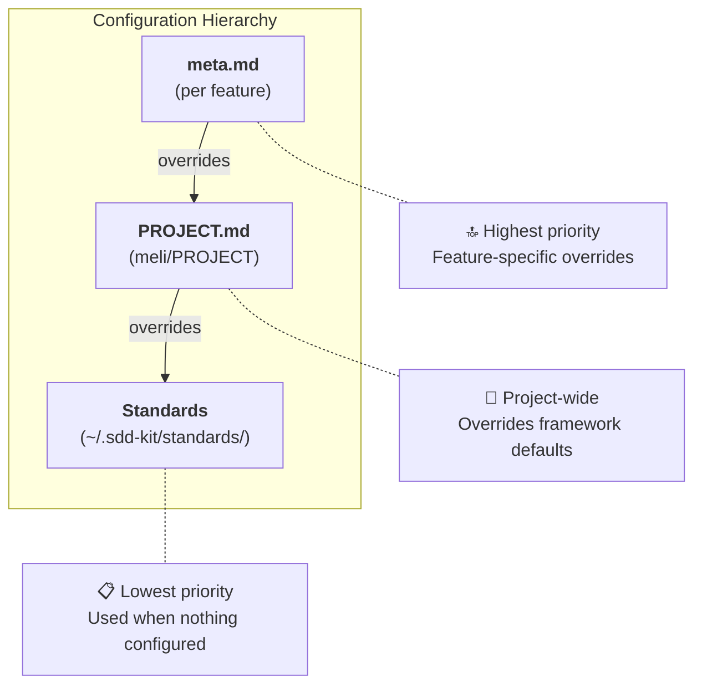

# Configuration Hierarchy

**Framework**: SDD Kit
**Last Updated**: 2025-01-02

---

## Overview

SDD Kit follows **convention over configuration**. The framework provides sensible defaults that work for most projects. You only need to configure what you want to change.

> **Coming from SpecKit?** `PROJECT.md` is equivalent to SpecKit's `constitution.md`. Same concept, different name.

---

## The Three Layers



**Resolution order**: meta.md → PROJECT.md → Framework Standards

---

## Layer 1: Framework Standards (Defaults)

**Location**: `~/.sdd-kit/standards/`

These files define the **default values** used when nothing is configured:

| Standard | Default Values |
|----------|---------------|
| `testing-strategy.md` | 80% coverage, unit/integration/e2e ratios |
| `tech-stack.md` | Recommended libraries per language |
| `coding-standards.md` | Formatting, naming conventions |
| `fury-guidelines.md` |  service recommendations |

**You don't edit these files**. They're part of the framework and get updated when you upgrade.

### governance.md - Special Case

`governance.md` defines **principles**, not configuration:

- Specification-first development
- AI-human collaboration model
- Quality gates are mandatory
- Testing is required
- Command safety rules

These are the **philosophy** of the framework. The numeric values mentioned (like "80% coverage") are references to the defaults in other standards, not configuration.

---

## Layer 2: PROJECT.md (Project Customization)

**Location**: `sdd/PROJECT.md`

This is where your team customizes the framework for your project.

### Convention Over Configuration

The template is **empty by default** (all sections commented out):

```yaml
# Uncomment only what you need to change

# coverage:
#   min_coverage: 80  ← Only uncomment if you need different value
```

**If not configured → Framework default is used**

### What You Can Configure

| Section | Purpose | Example Override |
|---------|---------|-----------------|
| `language` | Spec/comment language | `specs: es` for Spanish |
| `preferences` | Tech preferences | `orm: mybatis` instead of jpa |
| `coverage` | Test thresholds | `min_coverage: 60` for legacy |
| `reviews` | Review requirements | `code_review: optional` |
| `defaults` | Feature defaults | `project_type: prototype` |
| `forbidden` | Banned libraries | `- lombok` |

### Registering Overrides

When you configure a value that conflicts with framework standards, you should register it:

```yaml
overrides:
  - standard: testing-strategy.md
    rule: "Minimum coverage 80%"
    project_value: 50
    reason: "Legacy codebase, gradual improvement plan"
    registered_at: 2025-01-02
    registered_by: ddelgado
```

**Why register?**
- Documents the intentional deviation
- Prevents validation warnings
- Helps future maintainers understand decisions

### Validation

Run `/sdd.check --project` to:
- Detect unregistered conflicts
- Suggest override registration
- Verify PROJECT.md syntax

---

---

## PATTERNS.md - Project Knowledge Base

**Location**: `sdd/PATTERNS.md`

While PROJECT.md defines **team conventions** (architecture, coverage, language), PATTERNS.md accumulates **project learnings** (gotchas, best practices, internal libraries).

### How PATTERNS.md Works

| Source | When | Section |
|--------|------|---------|
| `/sdd.finish` | After completing feature | Technology sections (Go, Java, etc.) |
| `/sdd.project patterns` | Anytime (manual) | "Team Conventions" section |

### Adding Patterns Manually

Use `/sdd.project patterns` to add team conventions before completing features:

```bash
# Interactive wizard
/sdd.project patterns --add

# From description (AI-inferred)
/sdd.project patterns "usar axios en vez de fetch, moment.js prohibido"

# View current patterns
/sdd.project patterns
```

### Pattern Format

```markdown
**[Pattern Name]**:
- [What to do]
- [What not to do]
- Why: [Rationale]
- Example: [Optional code snippet]
```

### When to Use Each

| Need | Use |
|------|-----|
| Team prefers specific architecture | `PROJECT.md` → `preferences.architecture` |
| Team must use internal library X | `PATTERNS.md` → via `/sdd.project patterns --add` |
| Learned gotcha during feature | `PATTERNS.md` → auto-promoted by `/sdd.finish` |
| Ban a specific library | `PROJECT.md` → `forbidden` section |

### Reading Patterns

Patterns are automatically loaded in `/sdd.start` (Step 10) and influence:
- Technical spec generation (`/sdd.spec technical`)
- Task planning (`/sdd.plan`)
- Implementation decisions (`/sdd.build`)

---

## Layer 3: meta.md (Feature Override)

**Location**: `sdd/wip/<feature>/meta.md`

Override project settings for a specific feature only.

### Use Cases

```yaml
# Feature that needs different settings than project default

project_type: prototype  # This feature is experimental
testing:
  coverage_target: 0     # Skip tests for this prototype
ltp:
  enabled: false
```

### When to Use

- Experimental features that don't need full testing
- Quick prototypes within a production project
- Features with special requirements

---

## Examples

### Example 1: New Project (Use All Defaults)

```
sdd/PROJECT.md → Empty (all commented)
Result: Framework defaults apply (80% coverage, mandatory reviews, etc.)
```

### Example 2: Legacy Project (Override Coverage)

```yaml
# sdd/PROJECT.md
coverage:
  min_coverage: 50

overrides:
  - standard: testing-strategy.md
    rule: "Minimum coverage 80%"
    project_value: 50
    reason: "Legacy codebase with 45% current coverage"
```

### Example 3: Prototype Feature in Production Project

```yaml
# sdd/PROJECT.md
defaults:
  project_type: production  # Project default

# sdd/wip/experimental-ai/meta.md
project_type: prototype     # This feature only
```

---

## Quick Reference

| I want to... | Where to configure |
|--------------|-------------------|
| Change project-wide coverage | `sdd/PROJECT.md` → `coverage.min_coverage` |
| Skip tests for one feature | `meta.md` → `project_type: prototype` |
| Ban a library project-wide | `sdd/PROJECT.md` → `forbidden` |
| Use Spanish for specs | `sdd/PROJECT.md` → `language.specs: es` |
| See current defaults | `~/.sdd-kit/standards/` |

---

## MCP Environment Variables

Some MCP servers require authentication tokens set as environment variables.

### TIGER_TOKEN ()

**Required for**:  ( app management)

 uses Tiger token for authentication. This is handled by **mcp-remote-proxy >= 0.6.0**:

**How Authentication Works**:

1. **mcp-remote-proxy** handles token injection automatically
2. **Token acquisition**: The proxy calls `fury get-token` internally when needed
3. **Token refresh**: The proxy handles token expiration and re-acquisition

**Prerequisites**:
- `mcp-remote-proxy >= 0.6.0` installed (`pip install --upgrade mcp-remote-proxy`)
- User must be logged in to  CLI (``)

**No agent-level token management required** - the proxy handles all authentication.

**Note**: If  authentication fails repeatedly:
- Verify you're logged in: ``
- Upgrade proxy: `pip install --upgrade mcp-remote-proxy`
- You can still use "local validation mode" (see `/sdd.start` Step 1.5b.2)

---

## Related Documents

- [governance.md](./standards/governance.md) - Framework principles
- [testing-strategy.md](./standards/testing-strategy.md) - Testing defaults
- [PROJECT.md Template](./templates/project.md) - Configuration template
- [genai-validate-project.sh](./tools/genai/genai-validate-project.sh) - PROJECT.md validation
