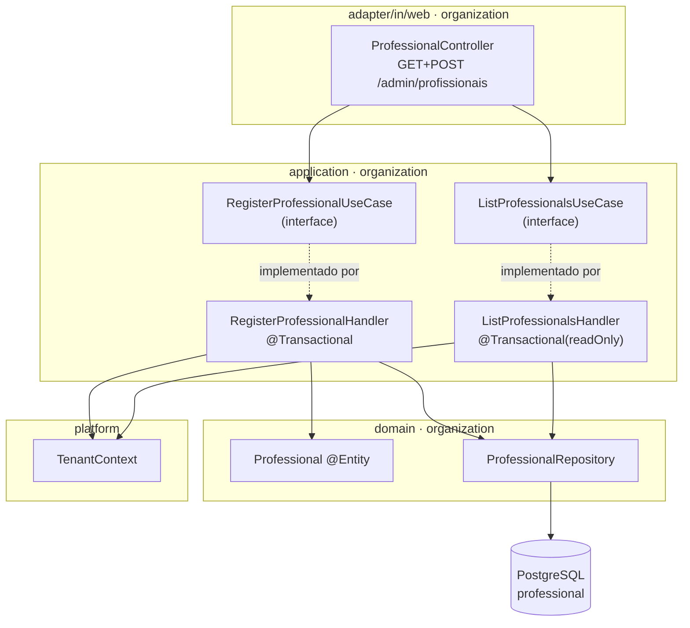

# cadastro-profissional - Technical Spec

**Feature**: cadastro-profissional
**Backlog**: TODO-002
**Status**: approved
**Data**: 2026-08-31
**Aprovado por**: Elton Marques em 2026-08-31T23:38:36Z
**Spec funcional**: [1-functional/spec.md](../1-functional/spec.md) — aprovada em 2026-08-31

> **Sobre validação automática**: `validate-technical.sh` não existe nesta
> instalação (mesma lacuna já documentada na TODO-001). Esta spec foi
> conferida manualmente contra `framework/templates/technical-spec.md` e,
> principalmente, contra o código real que a TODO-001 deixou em
> `organization` — que é o modelo a seguir, não um template genérico.

---

## Executive Summary

Uma tabela nova (`professional`), um segundo agregado em `organization`, e
uma tela só (`/admin/profissionais`) que cadastra e lista. Nenhuma dependência
nova, nenhuma migração de segurança — a rota já nasce protegida por estar sob
`/admin/**`, que a TODO-001 deixou autenticado por omissão.

Toca um único contexto: **`organization`**. `organization/api/` continua
adiado até a TODO-003 (decisão tomada antes desta spec).

---

## Architecture Overview



**Fluxo de cadastro**: `ProfessionalController` recebe o formulário, chama
`RegisterProfessionalUseCase.register(command)` — **sem nenhum parâmetro de
tenant na assinatura**. O handler lê `TenantContext.require()` por dentro,
exatamente como `ViewDashboardHandler` já faz (ver DD-1). Sucesso redireciona
para a própria tela, agora com a lista atualizada (padrão
Post-Redirect-Get, evita reenvio do formulário ao atualizar a página).

**Fluxo de listagem**: `GET /admin/profissionais` sempre chama
`ListProfessionalsUseCase.list()`, também sem parâmetro de tenant. A consulta
filtra por `TenantContext.require()` dentro do handler.

---

## Design Decisions

### DD-1: Nenhum caso de uso desta feature aceita tenant como parâmetro

**Selected**: `RegisterProfessionalCommand` carrega só `name`.
`ListProfessionalsUseCase.list()` não recebe argumento nenhum. Os dois
handlers leem `TenantContext.require()` internamente.

**Options Considered**:

- **A — Controller lê o `TenantContext` e passa o tenant explícito para o
  comando/caso de uso.** Mais "visível" à primeira leitura, mas reabre
  exatamente o risco que a revisão de segurança da TODO-001 apontou:
  qualquer chamador futuro do caso de uso — um outro controller, um job, um
  teste mal escrito — pode passar um tenant errado, e o compilador não
  reclama porque `TenantId` continua sendo um argumento válido de qualquer
  lugar.
- **B (selecionada) — Caso de uso sem parâmetro de tenant, ponto final.** Se
  a assinatura não aceita tenant, não existe chamada capaz de informar o
  errado. É o mesmo raciocínio do `ViewDashboardHandler` da TODO-001, agora
  virando convenção do contexto: **todo caso de uso que lê dado do
  estabelecimento da sessão não recebe tenant como argumento**.

**Trade-offs Accepted**: um caso de uso batch futuro que precisasse operar
"para todos os tenants" (ex.: um job de manutenção) não serve deste padrão —
precisaria de uma classe própria, fora do caminho request-scoped. Aceitável:
nenhuma feature do MVP precisa disso, e a exceção deve ficar explícita, não
virar a regra.

**Rationale**: multiplicar por N features a chance de alguém aceitar tenant
por parâmetro é multiplicar por N a chance de um dia alguém passar o errado.
Fechar a porta na assinatura custa nada e vale para sempre.

### DD-2: Uma tela só, cadastro e lista juntos

**Selected**: `GET /admin/profissionais` devolve a mesma tela sempre — lista
dos profissionais do tenant, com o formulário de cadastro logo acima. `POST`
no mesmo caminho processa e redireciona de volta para o `GET`.

**Options Considered**:

- **A — duas rotas**: `/admin/profissionais` (lista) e
  `/admin/profissionais/novo` (formulário). Mais formal, mas para um
  formulário de campo único obrigaria o dono a navegar entre duas telas só
  para ver o resultado do que acabou de cadastrar.
- **B (selecionada) — uma tela**: formulário e lista na mesma página. Depois
  de cadastrar, o dono já vê o profissional na lista, sem navegar.

**Trade-offs Accepted**: se a lista crescer para centenas de profissionais, a
mesma página fica pesada. Não é o caso de uma barbearia — e se um dia for,
pagina-se a lista sem tocar na decisão de ter uma rota só.

**Rationale**: menor fatia possível (contexto do próprio TODO-002 no
backlog) também vale para a navegação, não só para o código.

### DD-3: Sem restrição de unicidade em `professional.name`

**Selected**: nenhuma `UNIQUE` na migration, ao contrário de
`business.slug` e `app_user.email`.

**Options Considered**:

- **A — nome único por tenant**: impediria dois "João" no mesmo
  estabelecimento, mas BR (spec funcional, US-2) já decide que nome não é
  identificador, só rótulo — dois profissionais reais podem se chamar igual,
  e não é o sistema que deveria resolver esse conflito por eles.
- **B (selecionada) — sem restrição.** Nome é dado de exibição, o id é quem
  identifica.

**Trade-offs Accepted**: nenhum. Não há corrida a resolver — sem
constraint, não há violação possível, e por isso não há necessidade do
padrão de tradução de `DataIntegrityViolationException` que `Business`/`User`
precisam.

---

## Existing Data & Migrations

Nova tabela, mesma convenção de `V2__organization_create_business_and_user.sql`:

```sql
-- V3__organization_create_professional.sql

CREATE TABLE professional (
    id          uuid         PRIMARY KEY,
    tenant_id   uuid         NOT NULL REFERENCES business (id),
    name        varchar(120) NOT NULL,
    active      boolean      NOT NULL DEFAULT true,
    created_at  timestamptz  NOT NULL DEFAULT now(),
    updated_at  timestamptz  NOT NULL DEFAULT now(),

    CONSTRAINT professional_name_not_blank CHECK (length(btrim(name)) >= 2)
);

CREATE INDEX professional_tenant_idx ON professional (tenant_id);

COMMENT ON TABLE  professional IS 'Profissional que atende no estabelecimento. Pode ou não ter um app_user associado (fora de escopo nesta feature).';
COMMENT ON COLUMN professional.name IS 'Rótulo de exibição, não identificador. Duplicata entre profissionais do mesmo tenant é permitida (BR da spec funcional).';
```

Nenhuma restrição `UNIQUE` (DD-3). Índice em `tenant_id` pelo mesmo motivo de
`app_user_tenant_idx`: toda consulta desta feature filtra por tenant.

---

## Data Model

**Entrada** (`RegisterProfessionalCommand`): `name: String`.

**Saída da criação** (`RegisteredProfessional`): `id: UUID`, `name: String` —
projeção mínima, mesmo padrão de `RegisteredBusiness`.

**Saída da listagem** (`ProfessionalView`): `id: UUID`, `name: String` — a
lista não precisa de mais que isso; `active` fica de fora porque não há tela
de desativação nesta feature (Out of Scope), e nunca listamos inativos.

`ProfessionalRepository.findByTenantIdAndActiveTrueOrderByNameAsc(UUID
tenantId)` — ordenado por nome, não por data de criação: é uma lista que o
dono escaneia visualmente, e ordem alfabética é mais fácil de achar alguém do
que ordem de cadastro.

---

## REST API Contracts

> **Não há API REST** (ADR 0007). Rotas web renderizadas no servidor.

| Método | Rota | Autenticada | Resultado |
|---|---|---|---|
| GET | `/admin/profissionais` | sim | lista + formulário |
| POST | `/admin/profissionais` | sim | 302 → `/admin/profissionais`, ou 200 com erro de campo |

**POST `/admin/profissionais`** — corpo de formulário: `name`. Erro de
validação devolve **200 com a mesma tela**, incluindo a lista já cadastrada
recarregada — não só o erro do formulário. Sem isso, o dono perderia de vista
quem já tinha cadastrado ao errar o próximo nome.

---

## Security

Nenhuma superfície nova: a rota está sob `/admin/**`, autenticada por
omissão desde a TODO-001 — nenhuma mudança em `SecurityConfig`.

Isolamento entre tenants é estrutural, não validado em runtime (DD-1): como
nenhum método da camada de aplicação aceita tenant como argumento, não existe
caminho de código capaz de vazar um tenant errado — não é uma checagem que
possa ser esquecida, é uma checagem que não tem onde faltar.

CSRF: herda o comportamento padrão já configurado (ligado), formulário envia
o token via `th:action` do Thymeleaf, sem configuração adicional.

---

## Performance

Sem exigência especial. Lista de profissionais por estabelecimento é
pequena (dezenas, não milhares) — uma consulta simples com índice em
`tenant_id` é suficiente; não há paginação nesta feature.

---

## Testing Strategy

| Nível | Arquivo | Cobre |
|---|---|---|
| Unitário (domínio) | `ProfessionalTest.java` | `register()` valida nome; `deactivate()` |
| Unitário (aplicação) | `RegisterProfessionalHandlerTest.java`, `ListProfessionalsHandlerTest.java` | tenant vem do `TenantContext`, nunca de parâmetro |
| Camada web isolada | `ProfessionalControllerTest.java` | `@WebMvcTest`, erro de campo, CSRF |
| Integração | `ProfessionalRegistrationIT.java` | E2E-1, E2E-2, E2E-3, Testcontainers |
| Isolamento entre tenants | extensão de `CrossTenantIsolationIT.java` | tenant A não vê nem afeta profissional de tenant B |

---

## Implementation Locations

```
src/main/java/com/agendaia/organization/
├── domain/
│   ├── Professional.java
│   └── ProfessionalRepository.java
├── application/
│   ├── port/in/
│   │   ├── RegisterProfessionalUseCase.java
│   │   ├── RegisteredProfessional.java
│   │   ├── ListProfessionalsUseCase.java
│   │   └── ProfessionalView.java
│   ├── command/RegisterProfessionalCommand.java
│   ├── RegisterProfessionalHandler.java   @Transactional
│   └── ListProfessionalsHandler.java      @Transactional(readOnly)
└── adapter/
    └── in/web/
        ├── ProfessionalController.java
        └── request/RegisterProfessionalRequest.java

src/main/resources/
├── db/migration/V3__organization_create_professional.sql
└── templates/admin/profissionais.html

src/main/resources/templates/admin/dashboard.html   (editado: link no "Próximo passo")

src/test/java/com/agendaia/
├── organization/
│   ├── domain/ProfessionalTest.java
│   ├── application/RegisterProfessionalHandlerTest.java
│   ├── application/ListProfessionalsHandlerTest.java
│   ├── adapter/in/web/ProfessionalControllerTest.java
│   └── ProfessionalRegistrationIT.java
└── platform/CrossTenantIsolationIT.java   (estendido, não recriado)
```

---

## References

- [`sdd/features/20260830-cadastro-estabelecimento-login/`](../../../features/20260830-cadastro-estabelecimento-login/) — o exemplo de ponta a ponta que esta feature segue
- [`docs/domain/glossary.md`](../../../../docs/domain/glossary.md) — `Professional` como raiz de agregado
- [ADR 0002](../../../../docs/architecture/adr/0002-clean-architecture-com-rigor-proporcional.md), [ADR 0009](../../../../docs/architecture/adr/0009-uuidv7-como-identificador.md), [ADR 0011](../../../../docs/architecture/adr/0011-ciclo-de-vida-dos-dados.md)
