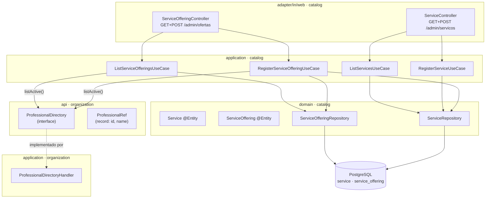

# cadastro-servico-oferta - Technical Spec

**Feature**: cadastro-servico-oferta
**Backlog**: TODO-003
**Status**: approved
**Data**: 2026-09-01
**Aprovado por**: Elton Marques em 2026-09-01T23:09:15Z
**Spec funcional**: [1-functional/spec.md](../1-functional/spec.md) — aprovada em 2026-09-01

> **Sobre validação automática**: `validate-technical.sh` não existe nesta
> instalação (mesma lacuna documentada nas duas features anteriores). Spec
> conferida manualmente contra o código real de `organization` e contra
> `docs/domain/glossary.md`/`data-model.md`, que já descreviam `Service` e
> `ServiceOffering` antes desta feature existir.

---

## Executive Summary

Dois agregados novos em `catalog` (`Service`, `ServiceOffering`), e o
primeiro pacote `api` de verdade do projeto: `organization.api`, com uma
única operação de leitura. `Money` nasce em `shared`. Duas telas, cada uma
no padrão "cadastro + lista" já estabelecido pela TODO-002.

Toca três pacotes: **`catalog`** (as duas entidades e os casos de uso),
**`organization`** (o novo pacote `api`), **`shared`** (`Money`).

---

## Architecture Overview



**Fluxo do cadastro de oferta** — o único que atravessa contexto:
`ServiceOfferingController` chama `RegisterServiceOfferingUseCase`. O
handler, dentro de `catalog`, chama `ProfessionalDirectory.listActive()` —
o pacote `api` de `organization` — para validar que o `professionalId`
recebido pertence ao tenant da sessão, **antes** de gravar. A mesma chamada
alimenta o dropdown no `GET`.

---

## Design Decisions

### DD-1: `organization.api` expõe uma operação só, sem parâmetro

**Selected**: `ProfessionalDirectory.listActive()` — sem argumento, tenant
lido de `TenantContext.require()` por dentro. Devolve
`List<ProfessionalRef>` (`id`, `name`).

**Options Considered**:

- **A — API por id** (`boolean existsActive(UUID professionalId)` ou
  `Optional<ProfessionalRef> findActive(UUID id)`): resolveria a validação,
  mas não serve para popular o dropdown da tela — precisaria de uma
  **segunda** operação (`listActive()`) de qualquer forma. Duas operações
  para dois usos que são, na prática, a mesma pergunta ("quem é válido
  agora?") feita de dois jeitos.
- **B (selecionada) — uma operação em lote**: `listActive()` serve os dois
  usos com a mesma chamada — o `GET` usa para montar o dropdown, o `POST`
  usa para validar (`lista.stream().anyMatch(p -> p.id().equals(recebido))`).
  Uma superfície pública a menos para manter, e nenhum id percorrido em
  laço (`PATTERNS.md`: "API entre contextos é grossa, nunca
  conversadeira").
- Tenant como parâmetro explícito, passado por `catalog`, foi descartado
  sem nem virar opção formal: repetiria o problema que o DD-1 da TODO-002
  já resolveu dentro de um contexto. Aqui a mesma regra atravessa a
  fronteira — `TenantContext` é mecanismo de `platform`, lido por
  `ThreadLocal`, e vale para qualquer classe rodando na mesma requisição,
  não importa de qual contexto.

**Trade-offs Accepted**: uma lista de profissionais inteira é buscada mesmo
quando só um id precisa ser validado — desprezível no volume esperado
(dezenas de profissionais por estabelecimento, não milhares).

**Rationale**: menos superfície pública, mesma garantia de tenant que já
existe dentro de `organization`, agora reaproveitada através da fronteira.

### DD-2: Nenhuma coluna de `catalog` que aponte para fora tem chave estrangeira — `tenant_id` incluído

**Selected**: `service.tenant_id` e `service_offering.tenant_id` são `uuid`
soltos, com índice — **sem** `REFERENCES business(id)`. Mesma regra que já
valia para `service_offering.professional_id`.

**Options Considered**:

- **A — `tenant_id` com FK para `business(id)`**: pareceria mais seguro (o
  banco recusaria um tenant inexistente), mas seria uma chave estrangeira
  de `catalog` para uma tabela de `organization` — exatamente o que
  `PATTERNS.md` proíbe ("Não faça JOIN entre tabelas de contextos
  diferentes... referência cruzada é UUID solto"). Tornaria o schema de
  `catalog` fisicamente dependente da existência da tabela `business` no
  mesmo banco — o oposto do que a separação por contexto quer garantir.
- **B (selecionada) — `tenant_id` sempre UUID solto, em toda tabela fora de
  `organization`.** Consistente com `professional_id`, e generaliza a regra
  em vez de abrir uma exceção só porque "é o tenant".

**Trade-offs Accepted**: nada impede, a nível de banco, um `tenant_id`
"órfão" numa tabela de `catalog`. Na prática é impossível de acontecer, já
que `tenant_id` nunca é digitado — vem sempre de `TenantContext`, que só
existe depois de um login real contra uma `Business` real.

**Rationale**: é a primeira vez que o projeto precisa decidir isso fora de
`organization`. Decidir aqui, de forma explícita, evita a pergunta se
repetir — e divergir — a cada contexto novo.

### DD-3: `Money` guarda centavos como `long`, sem operações aritméticas

**Selected**: `record Money(long cents)`, fábrica `Money.reais(BigDecimal)`,
método `format()` devolvendo `"R$ 30,00"`.

**Options Considered**:

- **A — `BigDecimal` como representação interna**: evita a conversão
  centavos↔reais, mas reabre a porta para erro de arredondamento se algum
  código futuro comparar `BigDecimal` por `equals` (que compara escala, não
  só valor — `30.0` ≠ `30.00`). Problema conhecido e evitável.
- **B (selecionada) — `long cents`**: aritmética inteira, sem
  arredondamento possível depois da conversão inicial. A conversão
  acontece uma vez só, na fábrica, a partir do que o formulário envia.

**Trade-offs Accepted**: nenhuma soma, subtração ou comparação nesta
versão — não há critério de aceite que precise. Adicionar depois é
extensão aditiva, não migração.

**Rationale**: `double`/`float` para dinheiro é erro conhecido; `long cents`
é a solução padrão, e o suficiente para "guardar e exibir", que é tudo que
esta feature pede.

### DD-4: Duas telas, uma por agregado — não uma tela combinada

**Selected**: `/admin/servicos` (cadastro + lista de `Service`) e
`/admin/ofertas` (cadastro + lista de `ServiceOffering`), cada uma seguindo
o padrão "uma tela só" já estabelecido pela TODO-002 (DD-2 daquela spec),
aplicado duas vezes — uma vez por agregado.

**Options Considered**:

- **A — uma tela combinada**: cadastrar `Service` e a primeira
  `ServiceOffering` juntos, num formulário só. Parece natural para o
  primeiro cadastro ("Corte de Cabelo, R$ 30, 30 min"), mas complica o
  segundo caso de uso real — adicionar uma oferta a um serviço que **já**
  existe, para outro profissional — que precisaria de um formulário
  diferente ou de lógica condicional escondendo campos.
- **B (selecionada) — duas telas simples**: o dono cadastra o serviço uma
  vez, depois cadastra quantas ofertas quiser para ele, sem caso especial
  nenhum. Generaliza para N profissionais no mesmo serviço sem
  ramificação.

**Trade-offs Accepted**: o primeiro cadastro exige duas visitas em vez de
uma. Aceitável — não é um fluxo que se repete várias vezes por dia.

---

## Existing Data & Migrations

```sql
-- V4__catalog_create_service_and_service_offering.sql

CREATE TABLE service (
    id           uuid         PRIMARY KEY,
    tenant_id    uuid         NOT NULL,  -- sem FK: fora do contexto (DD-2)
    name         varchar(120) NOT NULL,
    description  varchar(500),
    active       boolean      NOT NULL DEFAULT true,
    created_at   timestamptz  NOT NULL DEFAULT now(),
    updated_at   timestamptz  NOT NULL DEFAULT now(),

    CONSTRAINT service_name_not_blank CHECK (length(btrim(name)) >= 2),
    CONSTRAINT service_name_unique UNIQUE (tenant_id, name)
);

CREATE INDEX service_tenant_idx ON service (tenant_id);

COMMENT ON TABLE  service IS 'O conceito vendável ("Corte de Cabelo"). Sem preço nem duração — isso é da oferta.';
COMMENT ON COLUMN service.tenant_id IS 'UUID solto, sem FK: catalog não referencia tabela de organization (DD-2).';

CREATE TABLE service_offering (
    id                 uuid         PRIMARY KEY,
    tenant_id          uuid         NOT NULL,  -- sem FK, mesmo motivo
    service_id         uuid         NOT NULL REFERENCES service (id),  -- mesmo contexto: FK normal
    professional_id    uuid         NOT NULL,  -- outro contexto: UUID solto, sem FK
    duration_minutes   integer      NOT NULL,
    price_cents        bigint       NOT NULL,
    buffer_minutes     integer      NOT NULL DEFAULT 0,
    active             boolean      NOT NULL DEFAULT true,
    created_at         timestamptz  NOT NULL DEFAULT now(),
    updated_at         timestamptz  NOT NULL DEFAULT now(),

    CONSTRAINT service_offering_duration_positive CHECK (duration_minutes > 0),
    CONSTRAINT service_offering_price_not_negative CHECK (price_cents >= 0),
    CONSTRAINT service_offering_buffer_not_negative CHECK (buffer_minutes >= 0),
    -- Único por (tenant, service, professional) — um profissional tem no
    -- máximo uma oferta de cada serviço (BR-7, data-model.md).
    CONSTRAINT service_offering_unique UNIQUE (tenant_id, service_id, professional_id)
);

CREATE INDEX service_offering_tenant_idx ON service_offering (tenant_id);
CREATE INDEX service_offering_service_idx ON service_offering (service_id);

COMMENT ON TABLE  service_offering IS 'O que o cliente de fato agenda: um serviço executado por um profissional específico.';
COMMENT ON COLUMN service_offering.professional_id IS 'UUID solto, sem FK — profissional é de organization, outro contexto. Validado em memória via organization.api (DD-1), não pelo banco.';
COMMENT ON COLUMN service_offering.price_cents IS 'Centavos, inteiro — nunca decimal/double (DD-3 da spec técnica).';
```

---

## Data Model

**Entrada do cadastro de serviço** (`RegisterServiceCommand`): `name`,
`description` (opcional).

**Saída** (`RegisteredService`): `id`, `name`.

**Entrada do cadastro de oferta** (`RegisterServiceOfferingCommand`):
`serviceId`, `professionalId`, `durationMinutes`, `price` (`Money`),
`bufferMinutes`.

**Saída** (`RegisteredServiceOffering`): `id`.

**Listagem de ofertas** (`ServiceOfferingView`): `id`, `serviceName`,
`professionalName`, `durationMinutes`, `priceFormatted` — projeção já
resolvida (nomes, não ids), para o template não precisar de lógica.

**`organization.api.ProfessionalRef`**: `id`, `name` — o contrato exportado,
deliberadamente igual em forma a `ProfessionalView` (uso interno de
`organization`) mas um tipo **diferente**: um pertence à `api`, o outro a
`application.port.in`, e podem divergir livremente no futuro
(`PATTERNS.md`: "tipo de domínio interno nunca atravessa a fronteira").

---

## REST API Contracts

> **Não há API REST** (ADR 0007). Rotas web renderizadas no servidor.

| Método | Rota | Autenticada | Resultado |
|---|---|---|---|
| GET | `/admin/servicos` | sim | lista + formulário de serviço |
| POST | `/admin/servicos` | sim | 302 (PRG) ou 200 com erro de campo |
| GET | `/admin/ofertas` | sim | lista + formulário de oferta |
| POST | `/admin/ofertas` | sim | 302 (PRG) ou 200 com erro de campo |

**POST `/admin/ofertas`** — corpo: `serviceId`, `professionalId`,
`durationMinutes`, `price`, `bufferMinutes`. Erro de validação (formato,
duplicata, ou profissional de outro tenant) devolve 200 com a mesma tela,
lista recarregada — mesmo padrão de `/admin/profissionais` (TODO-002).

---

## Security

Rotas sob `/admin/**`, protegidas por omissão — sem mudança em
`SecurityConfig`.

O risco novo é estrutural, não de autenticação: **isolamento entre tenants
sem chave estrangeira** (DD-2). A garantia não vem do banco — vem de
`RegisterServiceOfferingHandler` chamar `ProfessionalDirectory.listActive()`
e recusar qualquer `professionalId` fora dessa lista, **antes** de gravar.
Coberto por BR-8 e E2E-3 da spec funcional, e por um caso novo em
`CrossTenantIsolationIT`.

---

## Performance

Sem exigência especial. `ProfessionalDirectory.listActive()` roda uma vez
por requisição de tela de oferta (GET ou POST), nunca em laço. Índice em
`tenant_id` nas duas tabelas novas, mesmo padrão das anteriores.

---

## Testing Strategy

| Nível | Arquivo | Cobre |
|---|---|---|
| Unitário (domínio) | `ServiceTest.java`, `ServiceOfferingTest.java`, `MoneyTest.java` | validações de cada agregado; `Money.reais()` e `format()` |
| Unitário (aplicação) | `RegisterServiceHandlerTest.java`, `RegisterServiceOfferingHandlerTest.java`, `ListServicesHandlerTest.java`, `ListServiceOfferingsHandlerTest.java` | tenant do contexto; validação de profissional via `ProfessionalDirectory` mockado |
| Camada web isolada | `ServiceControllerTest.java`, `ServiceOfferingControllerTest.java` | `@WebMvcTest`, erro de campo, CSRF |
| Integração | `ServiceOfferingRegistrationIT.java` | E2E-1, E2E-2, Testcontainers |
| Isolamento entre tenants | extensão de `CrossTenantIsolationIT.java` | E2E-3 |

---

## Implementation Locations

```
src/main/java/com/agendaia/shared/
└── Money.java

src/main/java/com/agendaia/organization/
├── api/
│   ├── ProfessionalDirectory.java
│   └── ProfessionalRef.java
└── application/
    └── ProfessionalDirectoryHandler.java   @Transactional(readOnly)

src/main/java/com/agendaia/catalog/
├── domain/
│   ├── Service.java
│   ├── ServiceRepository.java
│   ├── ServiceOffering.java
│   └── ServiceOfferingRepository.java
├── application/
│   ├── port/in/
│   │   ├── RegisterServiceUseCase.java
│   │   ├── RegisteredService.java
│   │   ├── ListServicesUseCase.java
│   │   ├── ServiceView.java
│   │   ├── RegisterServiceOfferingUseCase.java
│   │   ├── RegisteredServiceOffering.java
│   │   ├── ListServiceOfferingsUseCase.java
│   │   └── ServiceOfferingView.java
│   ├── command/
│   │   ├── RegisterServiceCommand.java
│   │   └── RegisterServiceOfferingCommand.java
│   ├── RegisterServiceHandler.java          @Transactional
│   ├── ListServicesHandler.java             @Transactional(readOnly)
│   ├── RegisterServiceOfferingHandler.java  @Transactional
│   └── ListServiceOfferingsHandler.java     @Transactional(readOnly)
└── adapter/in/web/
    ├── ServiceController.java
    ├── ServiceOfferingController.java
    └── request/
        ├── RegisterServiceRequest.java
        └── RegisterServiceOfferingRequest.java

src/main/resources/
├── db/migration/V4__catalog_create_service_and_service_offering.sql
└── templates/admin/
    ├── servicos.html
    └── ofertas.html

src/main/resources/templates/admin/dashboard.html   (editado: novo link)

src/test/java/com/agendaia/
├── shared/MoneyTest.java
├── organization/application/ProfessionalDirectoryHandlerTest.java
├── catalog/
│   ├── domain/{ServiceTest,ServiceOfferingTest}.java
│   ├── application/{RegisterServiceHandlerTest,RegisterServiceOfferingHandlerTest,ListServicesHandlerTest,ListServiceOfferingsHandlerTest}.java
│   ├── adapter/in/web/{ServiceControllerTest,ServiceOfferingControllerTest}.java
│   └── ServiceOfferingRegistrationIT.java
└── platform/CrossTenantIsolationIT.java   (estendido)
```

---

## References

- [`sdd/features/20260831-cadastro-profissional/`](../../../features/20260831-cadastro-profissional/) — DD-1 (tenant nunca por parâmetro) e DD-2 (uma tela só), agora estendidos
- [`docs/domain/glossary.md`](../../../../docs/domain/glossary.md) — `Service`/`ServiceOffering`, seção 3 ("três significados de serviço")
- [`docs/domain/data-model.md`](../../../../docs/domain/data-model.md) — schema conceitual das duas entidades
- [ADR sobre grade fixa de slot](../../../../docs/architecture/adr/0006-grade-fixa-como-unica-estrategia-de-slot.md) — por que `duration_minutes` não precisa ser múltiplo de 10
- [ADR sobre Spring Modulith](../../../../docs/architecture/adr/0010-spring-modulith-para-fronteira-entre-contextos.md) — o primeiro `@NamedInterface("api")` real do projeto
