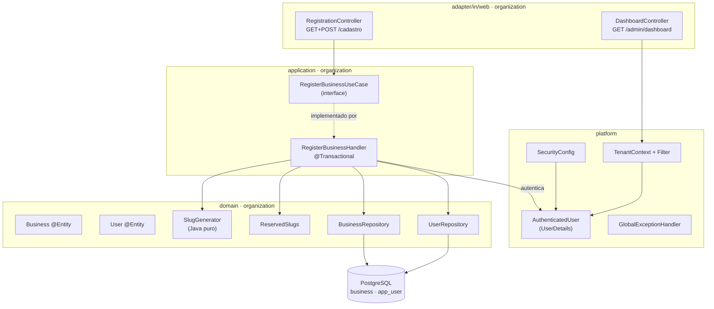

# cadastro-estabelecimento-login - Technical Spec

**Feature**: cadastro-estabelecimento-login
**Backlog**: TODO-001
**Status**: draft
**Data**: 2026-08-30
**Spec funcional**: [1-functional/spec.md](../1-functional/spec.md) — aprovada em 2026-08-30

> **Sobre validação automática**: `validate-technical.sh` não existe nesta
> instalação do kit (é um dos 22 scripts ausentes). Esta spec foi conferida
> manualmente contra as seções de `framework/templates/technical-spec.md`.

---

## Executive Summary

Duas tabelas novas (`business` e `app_user`), criadas na mesma transação pelo
cadastro. Autenticação por formulário com sessão, via Spring Security. Contexto
de tenant resolvido da sessão e propagado por filtro. Três telas Thymeleaf com
Bootstrap 5.

Toca dois contextos: **`organization`** (as entidades e o caso de uso) e
**`platform`** (segurança, contexto de tenant, tratamento de erro e layout base).

Nenhum serviço externo. Nenhuma integração. Nenhuma dependência nova além do
starter de segurança.

---

## Architecture Overview



**Fluxo do cadastro**: `RegistrationController` recebe o formulário, chama
`RegisterBusinessUseCase`. O `RegisterBusinessHandler` valida o slug, cria
`Business` e `User` numa transação, e autentica a sessão. Redireciona para o
painel.

---

## Design Decisions

### DD-1: `UserDetailsService` mora em `organization`, não em `platform`

**Selected**: a implementação de `UserDetailsService` fica em
`organization.adapter.out.security`. O `platform` declara o `SecurityConfig` e
depende apenas da **interface** do Spring.

**Options Considered**:

- **A — `UserDetailsService` em `platform`**: seria o lugar "natural" para
  segurança. Mas ele precisa carregar um `User`, que pertence a `organization`
  → `platform` passaria a depender de um contexto. Como todos os contextos
  dependem de `platform`, isso é um **ciclo**, e o Spring Modulith reprova.
- **B — porta própria em `platform`, implementada por `organization`**:
  resolve o ciclo, mas cria uma interface redundante — `UserDetailsService`
  do Spring já *é* exatamente essa porta.
- **C (selecionada) — implementação em `organization`, contrato do Spring**:
  `platform` depende de `org.springframework.security.core.userdetails.UserDetailsService`,
  que é biblioteca, não contexto. Zero ciclo, zero interface redundante.

**Trade-offs Accepted**: código de segurança fica repartido entre dois pacotes,
o que exige saber onde procurar. Aceito: a alternativa é um ciclo entre módulos,
que o build recusa.

**Rationale**: a regra de dependência ganha da arrumação temática. Onde a classe
"parece pertencer" perde para onde ela **pode** morar sem inverter a seta.

### DD-2: `AuthenticatedUser` fica em `platform`

**Selected**: o principal da sessão é `platform.security.AuthenticatedUser`,
carregando `userId`, `tenantId`, `businessName` e papel.

**Options Considered**:

- **A — principal em `organization`**: `platform` precisaria importá-lo para
  resolver o tenant → mesmo ciclo do DD-1.
- **B (selecionada) — principal em `platform`**: `organization` o constrói no
  login; `platform` o lê no filtro de tenant. A seta aponta para dentro nos dois
  sentidos de uso.

**Trade-offs Accepted**: `platform` conhece a forma do principal, então mudar
o que ele carrega toca infraestrutura. É estável o suficiente.

**Rationale**: é o mesmo raciocínio do DD-1 — quem é usado por todos mora na
base.

### DD-3: `business_slug_history` **não** entra nesta feature

**Selected**: apenas `business.slug` com restrição de unicidade. A tabela de
histórico fica para a feature que implementar troca de slug.

**Options Considered**:

- **A — criar as duas tabelas agora**, como prevê o modelo de dados. Descobre-se
  um problema: a unicidade do slug precisa valer **entre as duas tabelas**, e
  não existe restrição `UNIQUE` que atravesse tabelas. Um estabelecimento novo
  poderia tomar um slug que está no histórico de outro, e o redirecionamento
  passaria a apontar para o lugar errado.
- **B — tabela única de slugs** (`business_slug` com `active`), dando um domínio
  único de unicidade. É provavelmente a modelagem correta — e é uma decisão que
  merece ser tomada junto com a feature de troca de slug, não antes.
- **C (selecionada) — só `business.slug` por enquanto.** O slug é imutável nesta
  feature (BR-2). Criar a tabela de histórico para uma feature que não muda slug
  é adiantar uma decisão de modelagem sem ter o problema na frente.

**Trade-offs Accepted**: a feature de troca de slug vai precisar de uma migration
de reestruturação, não só de adição.

**Rationale**: o modelo de dados previa as duas tabelas, mas escrever a migration
expôs que a unicidade não fecha. Preferível descobrir agora e adiar do que
implementar errado.

> **Aviso para a feature futura**: a unicidade do slug precisa ser um domínio
> só. Ver opção B acima antes de simplesmente adicionar a tabela.

### DD-4: Derivação do slug no navegador é só preenchimento; a validação é do servidor

**Selected**: ~15 linhas de JavaScript puro preenchem o campo de slug enquanto o
nome é digitado. O servidor **valida o valor submetido** — não o rederiva.

**Options Considered**:

- **A — derivar só no servidor**: sem JavaScript, mas o dono só descobre o link
  depois de confirmar. O critério de aceite da US-2 exige ver antes.
- **B — derivar nos dois lados**: a mesma regra em Java e em JavaScript, que
  precisam concordar para sempre. Duplicação que diverge no primeiro ajuste.
- **C (selecionada) — JavaScript preenche, servidor valida**: o campo é editável,
  então o que vale é o valor submetido. O servidor confere formato, unicidade e
  palavras reservadas. Não há duas fontes da verdade porque **não há duas
  derivações** — há uma sugestão e uma validação.

**Trade-offs Accepted**: com JavaScript desligado, o campo chega vazio e o
formulário recusa pedindo o link. Aceito.

**Rationale**: o `PATTERNS.md` proíbe JavaScript "até existir interação real".
Ver o link se formando enquanto se digita é interação real, e são 15 linhas sem
biblioteca.

### DD-5: Autenticação programática precisa gravar na sessão explicitamente

**Selected**: depois de criar a conta, o handler autentica e **grava o contexto
no `SecurityContextRepository`**, não apenas no `SecurityContextHolder`.

**Options Considered**:

- **A — redirecionar para `/login` após o cadastro**, sem autenticação
  programática. Elimina o problema inteiro. Descartado na spec funcional: pedir
  a senha que a pessoa acabou de digitar é fricção sem ganho.
- **B — autenticar só via `SecurityContextHolder`**. É o que a maioria dos
  exemplos na internet mostra, e **está errado desde o Spring Security 6**: o
  contexto vive na thread da requisição e não vai para a sessão. Passa em teste
  unitário e falha no navegador.
- **C (selecionada) — autenticar e gravar explicitamente no
  `SecurityContextRepository`**, além de renovar a sessão contra fixação.

**Trade-offs Accepted**: o handler passa a conhecer detalhe de infraestrutura de
segurança, o que é um leve vazamento de camada. Aceito: a alternativa é o
usuário chegar deslogado no painel logo no primeiro contato com o produto.

**Rationale**: é o defeito mais provável desta feature, e o mais difícil de
diagnosticar — porque a suíte de testes fica verde.

### DD-6: A tabela de usuário se chama `app_user`

**Selected**: `app_user`, não `user`.

**Options Considered**:

- **A — tabela `user`, entre aspas duplas**. Funciona, e o JPA cuida disso
  sozinho. Mas toda consulta manual, todo script de manutenção e todo `psql` às
  duas da manhã precisam lembrar das aspas — e `SELECT * FROM user` devolve o
  usuário do banco, não a tabela, sem erro nenhum.
- **B (selecionada) — `app_user`**. Nome levemente pior, zero armadilha.

**Trade-offs Accepted**: a tabela deixa de espelhar exatamente o nome da
entidade (`User`), o que exige `@Table(name = "app_user")`. É uma linha.

**Rationale**: o incômodo das aspas é permanente e recai sobre quem está
depurando produção; o prefixo custa uma vez.

---

## Existing Data & Migrations

Não há dado preexistente: estas são as primeiras tabelas de negócio do sistema.

### `V2__organization_create_business_and_user.sql`

```sql
CREATE TABLE business (
    id          uuid         PRIMARY KEY,
    name        varchar(120) NOT NULL,
    slug        varchar(60)  NOT NULL,
    timezone    varchar(64)  NOT NULL DEFAULT 'America/Sao_Paulo',
    active      boolean      NOT NULL DEFAULT true,
    created_at  timestamptz  NOT NULL DEFAULT now(),
    updated_at  timestamptz  NOT NULL DEFAULT now(),

    CONSTRAINT business_slug_unique UNIQUE (slug),
    CONSTRAINT business_slug_format CHECK (slug ~ '^[a-z0-9]([a-z0-9-]*[a-z0-9])?$'),
    CONSTRAINT business_name_not_blank CHECK (length(btrim(name)) >= 2)
);

CREATE TABLE app_user (
    id             uuid         PRIMARY KEY,
    tenant_id      uuid         NOT NULL REFERENCES business (id),
    email          varchar(254) NOT NULL,
    name           varchar(120) NOT NULL,
    password_hash  varchar(72)  NOT NULL,
    role           varchar(20)  NOT NULL,
    active         boolean      NOT NULL DEFAULT true,
    created_at     timestamptz  NOT NULL DEFAULT now(),
    updated_at     timestamptz  NOT NULL DEFAULT now(),

    CONSTRAINT app_user_email_unique UNIQUE (email),
    CONSTRAINT app_user_role_valid   CHECK (role IN ('OWNER'))
);

CREATE INDEX app_user_tenant_idx ON app_user (tenant_id);
```

**Notas de modelagem**:

- `business` **não tem `tenant_id`** — ela *é* o tenant. Seu `id` é o `tenant_id`
  de todas as outras tabelas. É a única tabela de negócio isenta da regra do
  `PATTERNS.md`, e vale o comentário na migration.
- `password_hash` com 72 caracteres: BCrypt produz 60; a folga cobre variação de
  prefixo (`$2a$`, `$2b$`, `$2y$`) sem apertar.
- A restrição de formato do slug repete no banco o que o domínio já valida. É
  proposital — a mesma lógica do ADR 0005: validação em memória é feedback,
  garantia é do banco.
- `role` com `CHECK` de um valor só. Quando houver o segundo papel, a migration
  que o introduz altera a restrição — e assim ela documenta o que existe.

---

## Data Model

### `Business` — `organization.domain`

Entidade JPA, que **é** o modelo (regime CRUD do ADR 0002). Campos: `id`
(UUIDv7 gerado na aplicação), `name`, `slug`, `timezone`, `active`, `createdAt`,
`updatedAt`.

- Construtor privado; criação por `Business.register(name, slug)`.
- Sem setter público (`PATTERNS.md`). Acesso a campo pelo Hibernate, com
  construtor `protected` sem argumentos.
- Sem `@Data`, `@ToString` ou `@EqualsAndHashCode`.

### `User` — `organization.domain`

Campos: `id`, `tenantId`, `email`, `name`, `passwordHash`, `role`, `active`,
`createdAt`, `updatedAt`. Criação por `User.owner(tenantId, email, name, hash)`.

`tenantId` é `UUID` simples com `REFERENCES business(id)`: mesma tabela lógica,
mesmo contexto, então chave estrangeira é permitida.

### `SlugGenerator` — `organization.domain`

Classe **sem estado e sem dependência**, com um método estático. É a única lógica
com regra de verdade nesta feature, e por isso a mais testada.

| Entrada | Saída |
|---|---|
| `Barbearia do João` | `barbearia-do-joao` |
| `Salão & Cia.` | `salao-cia` |
| `Studio  da   Ana` | `studio-da-ana` |
| `Corte 10` | `corte-10` |
| `--Barbearia--` | `barbearia` |
| `!!!` | `""` (vazio → o formulário recusa) |

Implementação: `Normalizer.normalize(NFD)` para separar acentos, remoção da faixa
de diacríticos, minúsculas, troca de sequências não alfanuméricas por hífen
único, remoção de hífen das pontas.

### `ReservedSlugs` — `organization.domain`

Conjunto imutável com as 23 palavras da spec funcional.

---

## REST API Contracts

> **Não há API REST** (ADR 0007). O que segue são as rotas web renderizadas no
> servidor.

| Método | Rota | Autenticada | Resultado |
|---|---|---|---|
| GET | `/cadastro` | não | formulário |
| POST | `/cadastro` | não | 302 → `/admin/dashboard`, já autenticado |
| GET | `/login` | não | formulário |
| POST | `/login` | não | processado pelo Spring Security |
| POST | `/logout` | sim | 302 → `/login?logout` |
| GET | `/admin/dashboard` | sim | painel mínimo |

**POST `/cadastro`** — corpo de formulário: `name`, `slug`, `email`, `password`.
Erro de validação devolve **200 com a mesma tela** e os erros por campo, não 400
— é formulário HTML, não API.

**Regras de rota**:

- `/admin/**` exige sessão. Sem ela: 302 para `/login`, guardando o destino.
- `/cadastro`, `/login`, `/css/**`, `/js/**` e `/actuator/health` são públicos.
- Demais endpoints do actuator exigem autenticação.

---

## Security

| Requisito | Como |
|---|---|
| Senha | `BCryptPasswordEncoder`, força padrão |
| CSRF | Ligado (padrão do Spring Security); os formulários enviam o token via `th:action` |
| Enumeração de conta | Mensagem única no login; o `UserDetailsService` gasta tempo comparável mesmo quando o e-mail não existe |
| Fixação de sessão | `sessionFixation().newSession()` no login e após o cadastro |
| Isolamento de tenant | `tenant_id` sempre da sessão, nunca do cliente (ADR 0004) |
| Senha em log | Proibida. `password` não aparece em log de requisição nem em mensagem de erro |
| Cabeçalhos | Padrões do Spring Security mantidos |

**Segredos**: esta feature não introduz nenhum. Credencial do banco vem de
variável de ambiente, via `.env` (ignorado pelo git) ou do ambiente da VPS.
Nenhum segredo é versionado.

**Conta ou estabelecimento inativo**: `UserDetailsService` devolve o usuário como
desabilitado, e o Spring Security produz a mesma mensagem genérica — sem revelar
o motivo.

---

## Performance

Sem exigência. O cadastro é uma vez por estabelecimento; o login, poucas vezes
ao dia. BCrypt é deliberadamente lento e é a operação mais cara aqui — o que
está correto.

Índices: `UNIQUE` em `business.slug` e `app_user.email` (usados no login e na
validação), e `app_user_tenant_idx`.

---

## Testing Strategy

| Nível | Classe | Cobre |
|---|---|---|
| Unitário puro | `SlugGeneratorTest` | tabela de casos da derivação, incluindo entrada que gera slug vazio |
| Unitário puro | `ReservedSlugsTest` | pertinência e insensibilidade a maiúsculas |
| Unitário | `RegisterBusinessHandlerTest` | orquestração com repositórios mockados: e-mail duplicado, slug indisponível, slug reservado |
| Web | `RegistrationControllerTest` (`@WebMvcTest`) | rotas, erro por campo, CSRF |
| Integração | `RegistrationIT` (Testcontainers) | **E2E-1** — cadastro até o painel, autenticado |
| Integração | `LoginIT` | **E2E-2** — redirecionamento de volta à rota pretendida |
| Integração | `SlugUnavailableIT` | **E2E-3** — nenhum registro parcial criado |
| Integração | `CrossTenantIsolationIT` | dois estabelecimentos; nenhuma rota de um alcança dado do outro |

`SlugGeneratorTest` é o teste mais valioso da feature: regra pura, dezenas de
casos, milissegundos, sem Spring.

`CrossTenantIsolationIT` nasce aqui e **cresce a cada feature** — é o teste que
protege o ativo do produto.

---

## Deployment Strategy

Sem particularidade. A migration V2 é aditiva e não quebra nada: não há dado
anterior nem versão anterior em produção.

Ordem: Flyway aplica a V2 na subida; o Hibernate valida o mapeamento
(`ddl-auto: validate`) e falha rápido se divergir.

---

## Observability

A `TODO-108` (log estruturado com `tenantId` no MDC) ainda não foi feita. Esta
feature registra, com o mínimo:

- Cadastro concluído: `INFO`, com `businessId` e `slug` — **nunca** e-mail ou senha.
- Falha de login: `WARN`, sem o e-mail tentado (é dado pessoal).
- Violação de restrição do banco traduzida: `WARN`, sem stack trace.

---

## Dependencies

| Dependência | Situação |
|---|---|
| `spring-boot-starter-security` | **nova** |
| `spring-boot-starter-security-test` | **nova**, escopo de teste |
| `spring-boot-starter-thymeleaf` | **nova** |
| `thymeleaf-extras-springsecurity6` | **a confirmar** — o nome do artefato pode ter mudado no Boot 4; verificar no BOM antes de adicionar |
| `spring-boot-starter-data-jpa`, Flyway, Testcontainers, ArchUnit, Modulith | já presentes |
| Bootstrap 5 | por CDN, com `integrity` (ADR 0012) |

Nenhuma dependência externa ao projeto. Nenhuma chamada de rede em runtime.

> **Verificar antes de adicionar**: o Boot 4 renomeou starters de forma não
> uniforme. `webmvc` mudou, `data-jpa` não. Confirmar cada `artifactId` contra
> `spring-boot-dependencies:4.1.1` — foi o que evitou dois erros no andaime.

---

## Complexity Analysis

| Componente | Complexidade | Por quê |
|---|---|---|
| `SlugGenerator` | Baixa | função pura, muitos casos |
| Entidades e migration | Baixa | CRUD, sem invariante entre agregados |
| `RegisterBusinessHandler` | Média | transação única com duas entidades e autenticação programática |
| `SecurityConfig` + `TenantContext` | **Alta** | é infraestrutura nova, atravessa contextos, e o DD-5 é armadilha silenciosa |
| Telas Thymeleaf | Média | inclui o layout base, que ainda não existe |

O risco concentra-se em `platform`, não em `organization`.

---

## Technical Risks

| Risco | Impacto | Mitigação |
|---|---|---|
| Autenticação programática não persistida na sessão (DD-5) | Alto — usuário chega deslogado ao painel | `RegistrationIT` segue o redirecionamento e verifica que o painel abre autenticado |
| Ciclo entre `platform` e `organization` | Alto — quebra o build | DD-1 e DD-2 evitam por construção; `ModuleStructureTest` verifica |
| `thymeleaf-extras-springsecurity6` renomeado no Boot 4 | Baixo | confirmar no BOM antes de adicionar |
| Regra do slug divergindo entre navegador e servidor | Médio | DD-4 elimina: há sugestão e validação, não duas derivações |
| Corrida no cadastro do mesmo slug | Médio | `UNIQUE` no banco; o adapter traduz a violação em erro de campo |

---

## Open Questions

Nenhuma.

---

## Implementation Locations

```
src/main/java/com/agendaia/
├── organization/
│   ├── domain/
│   │   ├── Business.java                  @Entity
│   │   ├── User.java                      @Entity
│   │   ├── UserRole.java                  enum
│   │   ├── SlugGenerator.java             Java puro
│   │   ├── ReservedSlugs.java
│   │   ├── BusinessRepository.java        Spring Data
│   │   ├── UserRepository.java
│   │   └── exception/
│   │       ├── EmailAlreadyUsedException.java
│   │       └── SlugUnavailableException.java
│   ├── application/
│   │   ├── port/in/RegisterBusinessUseCase.java
│   │   ├── command/RegisterBusinessCommand.java
│   │   └── RegisterBusinessHandler.java   @Transactional
│   ├── adapter/
│   │   ├── in/web/
│   │   │   ├── RegistrationController.java
│   │   │   ├── DashboardController.java
│   │   │   └── request/RegistrationRequest.java
│   │   └── out/security/
│   │       └── BusinessUserDetailsService.java
│   └── config/OrganizationConfig.java
└── platform/
    ├── security/
    │   ├── SecurityConfig.java
    │   └── AuthenticatedUser.java
    ├── tenant/
    │   ├── TenantContext.java
    │   └── TenantContextFilter.java
    └── web/GlobalExceptionHandler.java

src/main/resources/
├── db/migration/V2__organization_create_business_and_user.sql
├── templates/
│   ├── fragments/layout.html
│   ├── auth/cadastro.html
│   ├── auth/login.html
│   └── admin/dashboard.html
└── static/js/slug.js
```

> **`organization/api/` não é criado nesta feature.** Nada consome
> `organization` ainda. Ele nasce na TODO-002, junto com `@NamedInterface("api")`
> — criar antes seria pacote vazio e anotação sem tipo para anotar.

---

## References

- [Spec funcional](../1-functional/spec.md)
- [ADR 0002](../../../../docs/architecture/adr/0002-clean-architecture-com-rigor-proporcional.md) — `organization` é CRUD: a entidade JPA é o modelo
- [ADR 0003](../../../../docs/architecture/adr/0003-identidade-dentro-de-organization.md) — `Business` e `User` na mesma transação
- [ADR 0004](../../../../docs/architecture/adr/0004-multi-tenancy-por-discriminador.md) — tenant da sessão
- [ADR 0007](../../../../docs/architecture/adr/0007-thymeleaf-server-side-sem-api-rest.md) — sem API REST
- [ADR 0009](../../../../docs/architecture/adr/0009-uuidv7-como-identificador.md) — UUIDv7 na aplicação
- [ADR 0010](../../../../docs/architecture/adr/0010-spring-modulith-para-fronteira-entre-contextos.md) — fronteira verificada
- [ADR 0012](../../../../docs/architecture/adr/0012-bootstrap-sem-build-com-tema-no-publico.md) — Bootstrap por CDN
- [Modelo de dados](../../../../docs/domain/data-model.md)
- [PATTERNS.md](../../../PATTERNS.md)
