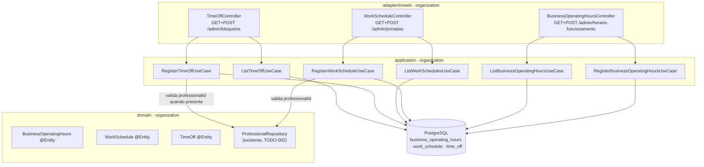

# horario-jornada-bloqueios - Technical Spec

**Feature**: horario-jornada-bloqueios
**Backlog**: TODO-004
**Status**: approved
**Data**: 2026-09-02
**Aprovado por**: Elton Marques em 2026-09-03T01:22:42Z
**Spec funcional**: [1-functional/spec.md](../1-functional/spec.md) — aprovada em 2026-09-02

> **Sobre validação automática**: `validate-technical.sh` não existe nesta
> instalação (mesma lacuna documentada nas três features anteriores). Spec
> conferida manualmente contra o código real de `organization` e contra
> `docs/domain/glossary.md`/`data-model.md`, que já descreviam os três
> agregados antes desta feature existir.

---

## Executive Summary

Três agregados novos, todos dentro de `organization` — nenhum outro
contexto é tocado, e não nasce nenhuma dependência nova de `api`.
`BusinessOperatingHours` e `WorkSchedule` seguem o mesmo regime CRUD de
`Business`/`Professional` (ADR 0002): entidade JPA é o modelo, repositório
em `application.port.out` (decisão de 2026-09-02). `TimeOff` é a única
peça com uma escolha de modelagem própria: `professional_id` anulável,
sem coluna de "tipo" separada.

Três telas, uma por agregado — mesmo padrão de "cadastro + lista" das
features anteriores, aplicado três vezes.

---

## Architecture Overview



**Fluxo com validação cruzada** — o único que consulta outra entidade antes
de gravar: `RegisterWorkScheduleHandler` e `RegisterTimeOffHandler` chamam
`ProfessionalRepository` (já existente, TODO-002) para confirmar que o
`professionalId` recebido pertence ao tenant da sessão. Como `Professional`
é do **mesmo contexto**, essa validação é reforçada por uma chave
estrangeira normal no banco — diferente da TODO-003, que precisou de
`organization.api` porque `Professional` estava em outro contexto.

---

## Design Decisions

### DD-1: Três telas, uma por agregado — não uma tela combinada

**Selected**: `/admin/horario-funcionamento`, `/admin/jornadas` e
`/admin/bloqueios`, cada uma no padrão "cadastro + lista" já estabelecido
(DD-2 da TODO-002, DD-4 da TODO-003).

**Options Considered**:

- **A — uma tela combinada** ("configurações de disponibilidade"): reuniria
  os três formulários numa página só. Pareceria conveniente para a primeira
  configuração, mas os três agregados têm cadência de uso muito diferente —
  horário de funcionamento é configurado uma vez e raramente muda; jornada
  de profissional muda quando alguém entra ou troca de horário; bloqueio é
  cadastrado a qualquer momento, sem relação com os outros dois. Uma tela só
  cresceria sem necessidade a cada vez que qualquer um dos três precisar de
  mais campos.
- **B (selecionada) — três telas simples**: cada agregado com seu próprio
  ciclo de cadastro e lista, sem dependência entre elas. Generaliza melhor
  quando `WorkSchedule` ou `TimeOff` precisarem de campos que
  `BusinessOperatingHours` nunca vai ter.

**Trade-offs Accepted**: a primeira configuração de um estabelecimento
exige três visitas em vez de uma. Aceitável — não é um fluxo que se repete
várias vezes por dia, e o painel já linka as telas relevantes (mesmo padrão
da TODO-003, TASK-010).

**Rationale**: consistência com as duas decisões de tela anteriores, e os
três agregados não compartilham dado nem formulário — só o tenant.

### DD-2: Sobreposição de `WorkSchedule` (BR-3) é validada em memória, não por exclusion constraint

**Selected**: `RegisterWorkScheduleHandler` consulta as faixas existentes
do mesmo profissional no mesmo dia e recusa em memória, antes do INSERT.
Sem `EXCLUDE` constraint no banco para esta tabela.

**Options Considered**:

- **A — `EXCLUDE USING gist`, mesma técnica do ADR 0005**: garantiria a
  regra pelo banco, não só pela aplicação. Mas o ADR 0005 se apoia em
  `tstzrange`, um tipo nativo do Postgres — `starts_at`/`ends_at` aqui são
  `time` (hora do dia, recorrente por `day_of_week`, sem data), e o
  Postgres **não tem um range type nativo sobre `time`**. Seria preciso
  criar um range type customizado (`CREATE TYPE ... AS RANGE (subtype =
  time)`) só para esta feature — introduz um conceito de schema novo que
  nem o ADR 0005 precisou.
- **B (selecionada) — validação em memória**: `RegisterWorkScheduleHandler`
  busca as faixas do profissional naquele dia (`findByTenantIdAndProfessionalIdAndDayOfWeekAndActiveTrue`)
  e verifica sobreposição no código, usando a mesma semântica de intervalo
  meio-aberto `[)` do restante do projeto (faixas encostadas — fim de uma
  igual ao início da outra — não se sobrepõem; é o mecanismo do almoço).

**Trade-offs Accepted**: existe uma janela de corrida teórica — duas
requisições simultâneas cadastrando faixas sobrepostas para o mesmo
profissional passariam as duas pela checagem em memória. Aceitável porque
quem cadastra `WorkSchedule` é sempre o dono autenticado, sozinho, em uma
tela administrativa — não um cliente público concorrendo por um horário,
que é exatamente o cenário que o ADR 0005 protege com `EXCLUDE` real. A
mesma janela de corrida já é aceita em `BR-1` (nome de serviço único,
TODO-003) para o caso análogo de baixa concorrência.

**Rationale**: criar um range type customizado para uma tela de
configuração administrativa de baixa concorrência é rigor fora de
proporção (ADR 0002). Se este raciocínio se mostrar errado — se o piloto
revelar cadastro simultâneo de verdade — a saída é registrar o range type
depois, sem migração de dado (a tabela não muda de formato).

### DD-3: `TimeOff.professionalId` nulo significa "estabelecimento inteiro" — sem coluna de tipo

**Selected**: `professional_id` é `uuid` **anulável**, sem FK obrigatória.
Nulo é o próprio sinal de "vale para todos" — não existe uma coluna
`scope` ou `type` (`PROFESSIONAL` vs `BUSINESS`) ao lado dela.

**Options Considered**:

- **A — coluna `scope` explícita** (`enum('PROFESSIONAL', 'BUSINESS')`):
  tornaria a intenção mais legível numa consulta SQL crua, mas duplicaria
  a informação que `professional_id IS NULL` já carrega — e abriria a
  possibilidade de um estado inconsistente (`scope = 'BUSINESS'` com
  `professional_id` preenchido).
- **B (selecionada) — nulo como sinal único**: já é a modelagem que o
  glossário e o data-model descrevem desde a Fase 0 (`docs/domain/data-model.md`,
  seção `TimeOff`). Sem estado inconsistente possível: um único campo
  decide os dois casos.

**Trade-offs Accepted**: quem lê a tabela direto no banco precisa saber a
convenção ("nulo = todos") em vez de ler um valor autoexplicativo. Aceitável
— documentado em `COMMENT ON COLUMN`, mesmo recurso já usado em
`service_offering.professional_id` (TODO-003).

**Rationale**: seguir a modelagem já normativa no glossário, sem inventar
um conceito novo que ele não previu.

---

## Existing Data & Migrations

```sql
-- V5__organization_create_operating_hours_schedule_and_timeoff.sql

-- ---------------------------------------------------------------------------
-- business_operating_hours — quando o estabelecimento PODE abrir.
--
-- Entidade de Business, sem identidade própria fora dele (glossário). Varias
-- faixas por dia sao permitidas; dia sem nenhuma faixa e dia fechado.
-- ---------------------------------------------------------------------------
CREATE TABLE business_operating_hours (
    id          uuid        PRIMARY KEY,
    tenant_id   uuid        NOT NULL REFERENCES business (id),
    day_of_week varchar(9)  NOT NULL,
    opens_at    time        NOT NULL,
    closes_at   time        NOT NULL,
    active      boolean     NOT NULL DEFAULT true,
    created_at  timestamptz NOT NULL DEFAULT now(),
    updated_at  timestamptz NOT NULL DEFAULT now(),

    CONSTRAINT business_operating_hours_range_valid CHECK (closes_at > opens_at)
);

CREATE INDEX business_operating_hours_tenant_idx ON business_operating_hours (tenant_id);

COMMENT ON TABLE  business_operating_hours IS 'Quando o estabelecimento pode abrir. Limite externo da disponibilidade (glossário).';
COMMENT ON COLUMN business_operating_hours.day_of_week IS 'Nome do java.time.DayOfWeek (MONDAY..SUNDAY), armazenado por extenso para legibilidade.';

-- ---------------------------------------------------------------------------
-- work_schedule — quando o profissional DECLARA que trabalha.
--
-- Raiz de agregado. Almoço recorrente é modelado como duas faixas no mesmo
-- dia (o vão entre elas É o almoço), nunca como TimeOff.
-- ---------------------------------------------------------------------------
CREATE TABLE work_schedule (
    id               uuid        PRIMARY KEY,
    tenant_id        uuid        NOT NULL REFERENCES business (id),
    professional_id  uuid        NOT NULL REFERENCES professional (id),
    day_of_week      varchar(9)  NOT NULL,
    starts_at        time        NOT NULL,
    ends_at          time        NOT NULL,
    active           boolean     NOT NULL DEFAULT true,
    created_at       timestamptz NOT NULL DEFAULT now(),
    updated_at       timestamptz NOT NULL DEFAULT now(),

    CONSTRAINT work_schedule_range_valid CHECK (ends_at > starts_at)
);

CREATE INDEX work_schedule_tenant_idx ON work_schedule (tenant_id);
CREATE INDEX work_schedule_professional_day_idx ON work_schedule (professional_id, day_of_week);

COMMENT ON TABLE  work_schedule IS 'Jornada recorrente semanal do profissional, em faixas. Dado declarado, nao calculado (glossário).';
COMMENT ON COLUMN work_schedule.professional_id IS 'FK normal: Professional é do mesmo contexto (organization), diferente de service_offering.professional_id (TODO-003, outro contexto).';

-- ---------------------------------------------------------------------------
-- time_off — indisponibilidade EXCEPCIONAL e datada.
--
-- professional_id anulável: nulo vale para o estabelecimento inteiro (feriado,
-- fechamento para reforma) -- sem tabela nem coluna de tipo separada (DD-3).
-- ---------------------------------------------------------------------------
CREATE TABLE time_off (
    id               uuid         PRIMARY KEY,
    tenant_id        uuid         NOT NULL REFERENCES business (id),
    professional_id  uuid         REFERENCES professional (id),
    starts_at        timestamptz  NOT NULL,
    ends_at          timestamptz  NOT NULL,
    reason           varchar(500),
    active           boolean      NOT NULL DEFAULT true,
    created_at       timestamptz  NOT NULL DEFAULT now(),
    updated_at       timestamptz  NOT NULL DEFAULT now(),

    CONSTRAINT time_off_range_valid CHECK (ends_at > starts_at)
);

CREATE INDEX time_off_tenant_idx ON time_off (tenant_id);
CREATE INDEX time_off_professional_idx ON time_off (professional_id);

COMMENT ON TABLE  time_off IS 'Indisponibilidade excepcional e datada. Feriado e fechamento do estabelecimento sao TimeOff sem profissional (glossário).';
COMMENT ON COLUMN time_off.professional_id IS 'Anulável de propósito: nulo significa que o bloqueio vale para todo o estabelecimento (DD-3).';
```

---

## Data Model

**Entrada do cadastro de horário de funcionamento**
(`RegisterBusinessOperatingHoursCommand`): `dayOfWeek`, `opensAt`,
`closesAt`.

**Saída** (`RegisteredBusinessOperatingHours`): `id`.

**Entrada do cadastro de jornada** (`RegisterWorkScheduleCommand`):
`professionalId`, `dayOfWeek`, `startsAt`, `endsAt`.

**Saída** (`RegisteredWorkSchedule`): `id`.

**Entrada do cadastro de bloqueio** (`RegisterTimeOffCommand`):
`professionalId` (opcional), `startsAt`, `endsAt`, `reason` (opcional).

**Saída** (`RegisteredTimeOff`): `id`.

**Listagens** (`BusinessOperatingHoursView`, `WorkScheduleView`,
`TimeOffView`) — projeções já resolvidas (nome do profissional, não id),
para o template não precisar de lógica. `TimeOffView.professionalName` é
`null` quando o bloqueio vale para o estabelecimento inteiro; o template
decide o texto de exibição ("Todos os profissionais").

---

## REST API Contracts

> **Não há API REST** (ADR 0007). Rotas web renderizadas no servidor.

| Método | Rota | Autenticada | Resultado |
|---|---|---|---|
| GET | `/admin/horario-funcionamento` | sim | lista + formulário de faixa de funcionamento |
| POST | `/admin/horario-funcionamento` | sim | 302 (PRG) ou 200 com erro de campo |
| GET | `/admin/jornadas` | sim | lista + formulário de jornada, com dropdown de profissional |
| POST | `/admin/jornadas` | sim | 302 (PRG) ou 200 com erro de campo |
| GET | `/admin/bloqueios` | sim | lista + formulário de bloqueio |
| POST | `/admin/bloqueios` | sim | 302 (PRG) ou 200 com erro de campo |

**POST `/admin/jornadas`** — corpo: `professionalId`, `dayOfWeek`,
`startsAt`, `endsAt`. Erro de validação (intervalo inválido, sobreposição,
ou profissional de outro tenant) devolve 200 com a mesma tela, lista
recarregada.

**POST `/admin/bloqueios`** — corpo: `professionalId` (vazio = "todos"),
`startsAt`, `endsAt`, `reason`. Mesmo padrão de erro de campo.

---

## Security

Rotas sob `/admin/**`, protegidas por omissão — sem mudança em
`SecurityConfig`. Isolamento entre tenants garantido por `tenant_id`
sempre lido do `TenantContext` (BR-7) e por chave estrangeira normal em
`professional_id` (BR-8) — aqui `Professional` é do mesmo contexto, então,
diferente da TODO-003, a garantia física existe desde o schema, sem
depender só de teste. Coberto por E2E-3 e pela extensão do
`CrossTenantIsolationIT`.

---

## Performance

Sem exigência especial. Cadastro é ação administrativa pouco frequente.
Índices em `tenant_id` nas três tabelas novas, e um índice composto
`(professional_id, day_of_week)` em `work_schedule` para a consulta de
sobreposição (DD-2) não varrer a tabela inteira.

---

## Testing Strategy

| Nível | Arquivo | Cobre |
|---|---|---|
| Unitário (domínio) | `BusinessOperatingHoursTest.java`, `WorkScheduleTest.java`, `TimeOffTest.java` | validações de cada agregado (BR-1, BR-2, BR-5) |
| Unitário (aplicação) | `RegisterBusinessOperatingHoursHandlerTest`, `RegisterWorkScheduleHandlerTest` (inclui BR-3 e BR-8), `RegisterTimeOffHandlerTest` (inclui BR-6/BR-8), e os três `ListXHandlerTest` | tenant do contexto; validação de profissional mockada via repositório |
| Camada web isolada | `BusinessOperatingHoursControllerTest`, `WorkScheduleControllerTest`, `TimeOffControllerTest` | `@WebMvcTest`, erro de campo, CSRF |
| Integração | `HorarioJornadaBloqueioRegistrationIT.java` | E2E-1, E2E-2, Testcontainers |
| Isolamento entre tenants | extensão de `CrossTenantIsolationIT.java` | E2E-3 |

---

## Implementation Locations

```
src/main/java/com/agendaia/organization/
├── domain/
│   ├── BusinessOperatingHours.java
│   ├── WorkSchedule.java
│   ├── TimeOff.java
│   └── exception/
│       ├── InvalidTimeRangeException.java
│       ├── WorkScheduleOverlapException.java
│       └── ProfessionalNotFoundException.java
├── application/
│   ├── port/in/
│   │   ├── RegisterBusinessOperatingHoursUseCase.java
│   │   ├── RegisteredBusinessOperatingHours.java
│   │   ├── ListBusinessOperatingHoursUseCase.java
│   │   ├── BusinessOperatingHoursView.java
│   │   ├── RegisterWorkScheduleUseCase.java
│   │   ├── RegisteredWorkSchedule.java
│   │   ├── ListWorkSchedulesUseCase.java
│   │   ├── WorkScheduleView.java
│   │   ├── RegisterTimeOffUseCase.java
│   │   ├── RegisteredTimeOff.java
│   │   ├── ListTimeOffUseCase.java
│   │   └── TimeOffView.java
│   ├── port/out/
│   │   ├── BusinessOperatingHoursRepository.java
│   │   ├── WorkScheduleRepository.java
│   │   └── TimeOffRepository.java
│   ├── command/
│   │   ├── RegisterBusinessOperatingHoursCommand.java
│   │   ├── RegisterWorkScheduleCommand.java
│   │   └── RegisterTimeOffCommand.java
│   ├── RegisterBusinessOperatingHoursHandler.java  @Transactional
│   ├── ListBusinessOperatingHoursHandler.java      @Transactional(readOnly)
│   ├── RegisterWorkScheduleHandler.java            @Transactional
│   ├── ListWorkSchedulesHandler.java               @Transactional(readOnly)
│   ├── RegisterTimeOffHandler.java                 @Transactional
│   └── ListTimeOffHandler.java                     @Transactional(readOnly)
└── adapter/in/web/
    ├── BusinessOperatingHoursController.java
    ├── WorkScheduleController.java
    ├── TimeOffController.java
    └── request/
        ├── RegisterBusinessOperatingHoursRequest.java
        ├── RegisterWorkScheduleRequest.java
        └── RegisterTimeOffRequest.java

src/main/resources/
├── db/migration/V5__organization_create_operating_hours_schedule_and_timeoff.sql
└── templates/admin/
    ├── horario-funcionamento.html
    ├── jornadas.html
    └── bloqueios.html

src/main/resources/templates/admin/dashboard.html   (editado: três novos links)

src/test/java/com/agendaia/organization/
├── domain/{BusinessOperatingHoursTest,WorkScheduleTest,TimeOffTest}.java
├── application/{RegisterBusinessOperatingHoursHandlerTest,ListBusinessOperatingHoursHandlerTest,
│                RegisterWorkScheduleHandlerTest,ListWorkSchedulesHandlerTest,
│                RegisterTimeOffHandlerTest,ListTimeOffHandlerTest}.java
├── adapter/in/web/{BusinessOperatingHoursControllerTest,WorkScheduleControllerTest,TimeOffControllerTest}.java
└── HorarioJornadaBloqueioRegistrationIT.java

src/test/java/com/agendaia/platform/CrossTenantIsolationIT.java   (estendido)
```

---

## References

- [`sdd/features/20260901-cadastro-servico-oferta/`](../../../features/20260901-cadastro-servico-oferta/) — DD-4 (uma tela por agregado), agora aplicado a três
- [`docs/domain/glossary.md`](../../../../docs/domain/glossary.md) — `BusinessOperatingHours`, `WorkSchedule`, `TimeOff`
- [`docs/domain/data-model.md`](../../../../docs/domain/data-model.md) — schema conceitual dos três agregados
- [ADR 0002](../../../../docs/architecture/adr/0002-clean-architecture-com-rigor-proporcional.md) — regime CRUD; amendment de 2026-09-02 (repositório em `application.port.out`)
- [ADR 0005](../../../../docs/architecture/adr/0005-exclusion-constraint-contra-overbooking.md) — por que a mesma técnica não se aplica a `WorkSchedule` (DD-2)
- [ADR 0011](../../../../docs/architecture/adr/0011-ciclo-de-vida-dos-dados.md) — nada é apagado, `deactivate()` sem tela
