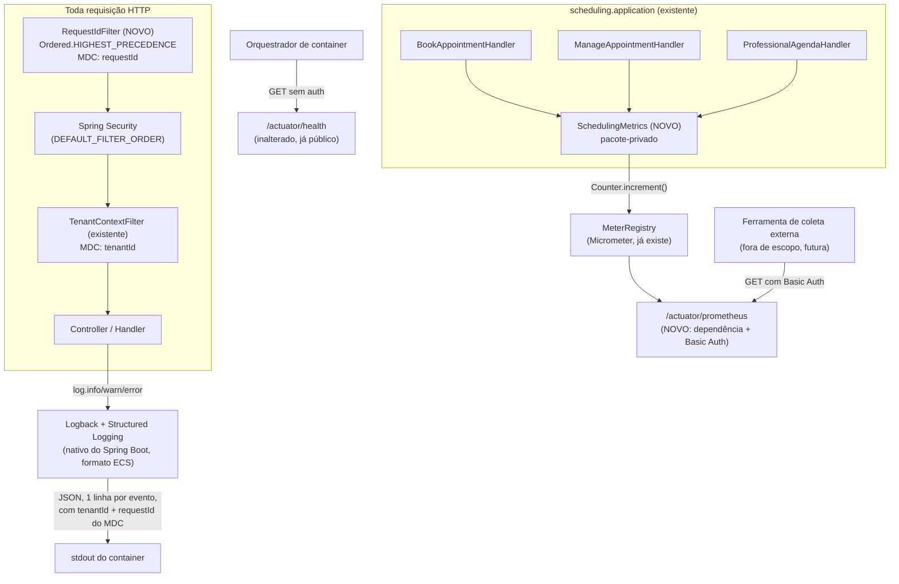

# observabilidade - Technical Spec

**Feature**: observabilidade
**Backlog**: TODO-108
**Status**: approved
**Data**: 2026-09-07
**Aprovado por**: Elton Marques em 2026-09-07T17:14:37Z

---

## Executive Summary

Feature transversal, sem agregado nem tela nova. Três frentes independentes:

1. **Log estruturado**: liga o suporte nativo de *Structured Logging* do
   Spring Boot (desde a série 3.4, presente na 4.1.1 já usada aqui) —
   sem biblioteca nova. `tenantId` já vai para o MDC
   (`TenantContextFilter`); esta feature soma um `requestId` novo, via
   filtro, e **unifica** com o identificador de erro que
   `GlobalExceptionHandler` já gera ad-hoc só para o log de exceção
   (achado durante o desenho desta spec — ver DD-2).
2. **Métricas de negócio**: três contadores Micrometer (já trazido pelo
   `spring-boot-starter-actuator`), instrumentados nos handlers de
   `scheduling.application` que já existem.
3. **`/actuator/prometheus` funcional e protegido**: falta a dependência
   `micrometer-registry-prometheus` (configurado no `application.yaml`,
   mas nunca funcionou de fato); protegido por HTTP Basic Auth dedicado,
   independente da sessão do dono — mesmo padrão de conta única já usado
   para o operador (`AGENDAIA_OPERADOR_*`).

Nenhuma migration, nenhum agregado, nenhuma tabela nova.

---

## Architecture Overview



---

## Design Decisions

### DD-1: Log estruturado via *Structured Logging* nativo do Spring Boot — sem dependência nova

**Selected**: `logging.structured.format.console: ecs` no `application.yaml`.

**Options Considered**:
- **ECS (Elastic Common Schema)** — formato nativo do Spring Boot desde a
  3.4, já presente na versão usada aqui (4.1.1). Zero dependência nova.
  MDC entra automaticamente como campo do JSON.
- **`logstash-logback-encoder`** (dependência externa) — era a solução
  padrão antes do Spring Boot ter suporte nativo. Mais configurável, mas
  adiciona uma dependência para resolver algo que o próprio framework já
  resolve.
- **Formato customizado** (`logging.structured.format.console: <classe>`)
  — dá controle total do schema, mas exige escrever e manter um
  formatter próprio sem nenhum requisito que justifique isso hoje.

**Trade-offs Accepted**: ECS é um schema pensado para Elastic/ELK; se o
destino final dos logs vier a ser outra ferramenta (ex.: Loki, Datadog),
pode exigir trocar para `logstash` ou `gelf` — troca de uma linha de
configuração, sem mudança de código.

**Rationale**: Nenhuma ferramenta de coleta de log existe ainda (só surge
com a IDEA-013). Não há motivo para escolher um schema pensado para uma
ferramenta específica agora — ECS é o formato "genérico" mais usado, e a
troca futura é barata. Evita dependência nova para resolver o que o
framework já resolve nativamente.

### DD-2: `RequestIdFilter` novo — e ele substitui o identificador ad-hoc do `GlobalExceptionHandler`

**Selected**: Filtro `com.agendaia.platform.web.RequestIdFilter`,
`@Order(Ordered.HIGHEST_PRECEDENCE)` (roda antes de tudo, inclusive do
Spring Security) — gera um id novo (`UUID.randomUUID().toString().substring(0,
8)`, mesmo formato já em uso), põe em `MDC.put("requestId", id)`, adiciona
como cabeçalho de resposta `X-Request-Id`, e limpa no `finally`.
`GlobalExceptionHandler.erroInesperado` passa a ler `MDC.get("requestId")`
em vez de gerar um novo — **um achado durante o desenho desta spec**:
`GlobalExceptionHandler` (linha 75, código atual) já gera
`UUID.randomUUID().toString().substring(0, 8)` para mostrar na tela de
erro 500, mas só existe *ali*, só para aquela linha de log — não aparece
em nenhuma outra linha da mesma requisição.

**Options Considered**:
- **Filtro novo + reaproveitar formato existente (selecionado)**: uma
  fonte só de verdade para o id de correlação; a tela de erro continua
  mostrando exatamente o mesmo id que aparece em toda linha de log da
  requisição, não um id diferente.
- **Manter os dois mecanismos separados**: mais simples de implementar
  (menos um arquivo tocado), mas deixa dois conceitos de "id de
  correlação" coexistindo — o da tela de erro (só a linha de exceção) e
  o do MDC (toda linha, exceto a de exceção, que teria outro). Confuso
  para quem for investigar.
- **Aceitar um header de entrada (`X-Request-Id`) vindo de um proxy
  reverso**, gerando só se ausente: mais correto para quando existir um
  proxy na frente (Caddy, TODO-106). Não implementado agora — nenhum
  proxy existe ainda, e adicionar esse caminho sem poder testá-lo de
  verdade seria especulativo.

**Trade-offs Accepted**: quando a TODO-106 (Caddy) existir, pode fazer
sentido o proxy já gerar/propagar esse id — revisitar então; não é
retrabalho, é extensão (`if (header presente) usa; senão gera`).

**Rationale**: Unificar os dois é estritamente melhor com o mesmo custo
de implementação — o `GlobalExceptionHandler` já precisa ser tocado de
qualquer forma para os testes desta feature confirmarem que log e tela
mostram o mesmo id.

### DD-3: Três contadores Micrometer, instrumentados nos handlers de aplicação existentes

**Selected**: Classe pacote-privada `SchedulingMetrics` em
`scheduling.application` (mesmo pacote de `BookAppointmentHandler`,
`ManageAppointmentHandler`, `ProfessionalAgendaHandler` — não precisa ser
pública), injetada nos três. Nomes Micrometer:
`agendaia.appointments.created`, `agendaia.appointments.cancelled`,
`agendaia.appointments.slot_conflict` — o `PrometheusMeterRegistry` já
traduz para `agendaia_appointments_created_total` etc. no formato de
scrape, sem configuração extra.

**Options Considered**:
- **Instrumentar dentro de `AppointmentFactory`/`Appointment` (domínio)**
  — pareceria mais "central", mas `AppointmentFactory.buildAndSave` é
  chamado também pelo reagendamento (que não deve contar como "criado",
  ver regra abaixo) e `Appointment.cancel()`/`cancelByOwner()` são
  métodos de domínio puro (ADR 0002) — não podem depender de
  `MeterRegistry` (biblioteca de infraestrutura). Rejeitada.
- **Instrumentar nos handlers de aplicação (selecionada)**: cada handler
  já sabe exatamente qual operação de negócio está executando, e é onde
  o restante do projeto já toma decisão de transação e de exceção — o
  lugar certo para decidir "isto conta como criado/cancelado/falha", sem
  violar a pureza do domínio.

**Trade-offs Accepted**: reagendamento (`ProfessionalAgendaHandler.reschedule`)
usa `AppointmentFactory.buildAndSave` (que só grava) e
`appointmentRepository.updateStatus` (que só cancela) por baixo, mas por
decisão desta spec **não soma em "criado" nem em "cancelado"** — ver
regra de negócio abaixo. Isso significa que os três contadores, somados,
não batem exatamente com `SELECT COUNT(*) FROM appointment` — são
métricas de **evento de negócio**, não um espelho da tabela.

**Rationale**: A spec funcional (US-2) só pede o contador para "criado
pela reserva pública e pela criação manual" e "cancelado" sem
especificar reagendamento — reagendar é semanticamente "mover", não
"criar mais um" nem "desistir de um". Tratar como criação+cancelamento
infla os dois contadores toda vez que o dono corrige um erro de horário,
escondendo o número real de clientes novos e de desistências reais.

**Regra de contagem exata**:

| Operação | `created` | `cancelled` | `slot_conflict` |
|---|---|---|---|
| `BookAppointmentHandler.handle` (sucesso) | +1 | — | — |
| `BookAppointmentHandler.handle` (`SlotUnavailableException`) | — | — | +1 |
| `ProfessionalAgendaHandler.create` (sucesso) | +1 | — | — |
| `ProfessionalAgendaHandler.create` (`SlotUnavailableException`) | — | — | +1 |
| `ManageAppointmentHandler.cancel` (transição real para `CANCELLED`) | — | +1 | — |
| `ManageAppointmentHandler.cancel` (no-op, já `CANCELLED`) | — | — | — |
| `ProfessionalAgendaHandler.cancel` (transição real) | — | +1 | — |
| `ProfessionalAgendaHandler.cancel` (no-op) | — | — | — |
| `ProfessionalAgendaHandler.reschedule` (sucesso) | — | — | — |
| `ProfessionalAgendaHandler.reschedule` (`SlotUnavailableException` no novo horário) | — | — | +1 |

### DD-4: `/actuator/prometheus` atrás de uma terceira `SecurityFilterChain`, com HTTP Basic Auth dedicado

**Selected**: `MetricsSecurityConfig` (`platform.security`), `@Order(0)`
— roda antes de `OperatorSecurityConfig` (`@Order(1)`) e `SecurityConfig`
(`@Order(2)`) — `securityMatcher("/actuator/prometheus")`,
`.httpBasic(Customizer.withDefaults())`, `anyRequest().hasRole("METRICS")`.
Usuário único em `InMemoryUserDetailsManager`, mesmo padrão de
`AGENDAIA_OPERADOR_PASSWORD_HASH` (hash BCrypt pré-computado em variável
de ambiente, nunca senha crua).

**Options Considered**:
- **Atrás da sessão `OWNER` existente (rejeitada)**: uma ferramenta de
  coleta automatizada não faz login por formulário nem guarda cookie de
  sessão — inutilizável na prática para o propósito real do endpoint.
- **HTTP Basic Auth dedicado (selecionada)**: qualquer coletor
  (Prometheus, Grafana Cloud Agent, um `curl` num cronjob) sabe fazer
  Basic Auth nativamente, sem nenhuma integração especial.
- **Token estático num cabeçalho customizado**: funcionalmente
  equivalente ao Basic Auth para este caso, mas exige um mecanismo de
  autenticação Spring Security customizado — Basic Auth já vem pronto no
  framework, sem justificativa para reinventar.

**Trade-offs Accepted**: mais uma cadeia de segurança para manter — mas
o padrão (`@Order`, `securityMatcher`, `UserDetailsService` próprio) já
está estabelecido por `OperatorSecurityConfig`; esta é a terceira
ocorrência do mesmo padrão, não um conceito novo.

**Rationale**: Corresponde exatamente à BR-2 da spec funcional
("independente da sessão OWNER") e ao raciocínio já usado no projeto para
contas sem tenant (o operador).

### DD-5: `micrometer-registry-prometheus` — dependência que falta para o endpoint existir de verdade

**Selected**: Adicionar `io.micrometer:micrometer-registry-prometheus`
ao `pom.xml` (sem versão explícita — gerenciada pelo
`spring-boot-dependencies` BOM, mesmo padrão das demais dependências do
projeto).

**Options Considered**:
- **Não adicionar, e desistir do endpoint `/actuator/prometheus`**: mas
  o próprio `application.yaml` já pede isso desde antes desta feature —
  contradiria a config existente. Rejeitada.
- **Adicionar a dependência (selecionada)**: única forma de o endpoint
  existir de verdade — sem ela, `PrometheusMeterRegistry` nunca é
  autoconfigurado, e o endpoint devolve 404 mesmo com
  `management.endpoints.web.exposure.include` correto.

**Trade-offs Accepted**: nenhum — é a dependência padrão da própria
documentação do Spring Boot para este cenário exato, mesma família do
`spring-boot-starter-actuator` já presente.

**Rationale**: Sem isso, toda a DD-3 e DD-4 não têm efeito nenhum — o
endpoint que elas protegem/alimentam simplesmente não existiria.

---

## Existing Data & Migrations

Nenhuma. Esta feature não cria, altera nem lê nenhuma tabela — os três
contadores vivem em memória (padrão do `MeterRegistry`), reiniciando a
zero a cada subida da aplicação, mesmo comportamento de qualquer métrica
Prometheus do tipo `Counter`.

---

## Data Model

Não aplicável — sem agregado, sem entidade JPA nova. Os dois conceitos
técnicos (`requestId`, contador de métrica) são transversais, sem chave
de negócio além do próprio nome da métrica ou do escopo da requisição.

---

## Cross-Context API Contracts

Nenhum contrato de negócio novo (sem rota admin, sem rota pública). Três
comportamentos de endpoint operacional, todos já existentes na
configuração, mudando de comportamento:

| Endpoint | Antes desta feature | Depois desta feature |
|---|---|---|
| `GET /actuator/health` | Público, `{"status":"UP"}` | Inalterado |
| `GET /actuator/prometheus` | 404 (dependência ausente) | 401 sem Basic Auth; 200 com credencial correta, corpo no formato de exposição do Prometheus |
| `GET /actuator/info` | Implícito em `anyRequest().hasRole("OWNER")` | Inalterado (fora de escopo, ver Assumptions da spec funcional) |

---

## Security

- **Segredo novo**: `AGENDAIA_METRICS_USERNAME` (padrão de
  desenvolvimento: `metrics`) e `AGENDAIA_METRICS_PASSWORD_HASH` (hash
  BCrypt, padrão de desenvolvimento gerado uma vez para uso local —
  qualquer implantação real PRECISA sobrescrever as duas variáveis,
  mesmo aviso já presente para `AGENDAIA_OPERADOR_*`). Nunca em texto
  puro no código nem em log.
- **`requestId` não é segredo** — é seguro expor em cabeçalho de resposta
  (`X-Request-Id`) e na tela de erro (já acontecia antes desta feature,
  só que com um valor gerado à parte).
- **LGPD (BR-4 da spec funcional)**: nenhuma linha de log desta feature
  imprime `Customer` inteiro nem seus campos — os handlers já não fazem
  isso (`Customer.toString()` foi escrito deliberadamente sem nome/
  telefone). A auditoria desta spec confirmou, por busca no código-fonte
  inteiro, que nenhum `log.*` atual referencia telefone ou nome de
  cliente diretamente. O teste E2E-4 (funcional) garante isso continue
  valendo depois da mudança de formato.
- **`/actuator/prometheus` não vaza dado de negócio sensível**: os três
  contadores são só números agregados, sem identificar nenhum cliente
  nem estabelecimento (BR-3 da spec funcional — sem tag de tenant).

---

## Performance

- `RequestIdFilter` faz uma geração de `UUID` e duas operações de MDC
  por requisição — mesmo custo de ordem de grandeza do que
  `TenantContextFilter` já faz hoje, overhead desprezível.
- Os três `Counter.increment()` são operações atômicas em memória
  (implementação padrão do Micrometer) — não fazem I/O, não têm
  contenção relevante no volume de um piloto único.
- Log estruturado (JSON) tem custo de serialização ligeiramente maior
  que texto plano, mas é o mesmo trade-off que qualquer aplicação em
  produção já aceita — não há requisito de latência desta feature que
  essa diferença ameace.

---

## Testing Strategy

| Camada | O que testa |
|---|---|
| Unit (`RequestIdFilterTest`) | Requisição gera `requestId` novo no MDC; MDC é limpo depois; cabeçalho `X-Request-Id` presente na resposta. |
| Unit (`SchedulingMetricsTest`) | Os três métodos incrementam o contador certo, isolado de qualquer handler. |
| Unit (`GlobalExceptionHandlerTest`, editado) | `erroInesperado` usa o `requestId` do MDC (não gera um novo) — mesmo valor na tela e no log. |
| Aplicação (`BookAppointmentHandlerTest`, `ManageAppointmentHandlerTest`, `ProfessionalAgendaHandlerTest`, editados) | Cada handler chama o método certo de `SchedulingMetrics` na condição certa (tabela da DD-3), via mock. |
| Integração (`ObservabilidadeIT`, Postgres real) | E2E-1 a E2E-4 da spec funcional: log de uma requisição autenticada é JSON com `tenantId`+`requestId`; `/actuator/health` sem auth; `/actuator/prometheus` exige credencial e expõe os três contadores incrementados depois de operações reais; nenhuma linha de log de um fluxo completo de agendamento contém nome nem telefone do cliente. |

**Como capturar log JSON no teste de integração**: redirecionar
`System.out` para um buffer durante a chamada HTTP (`MockMvc` real
contra o contexto todo), depois parsear cada linha capturada como JSON
(Jackson) — valida o que realmente sai no console do container, sem
acoplar o teste à API interna do Logback.

---

## Implementation Locations

```
platform/
  web/
    RequestIdFilter.java                    [NOVO]
    GlobalExceptionHandler.java              [EDITADO — lê requestId do MDC]
  security/
    MetricsSecurityConfig.java               [NOVO]

scheduling/
  application/
    SchedulingMetrics.java                   [NOVO, pacote-privado]
    BookAppointmentHandler.java              [EDITADO — chama created/slotConflict]
    ManageAppointmentHandler.java            [EDITADO — chama cancelled]
    ProfessionalAgendaHandler.java           [EDITADO — chama created/cancelled/slotConflict]

resources/
  application.yaml                           [EDITADO — logging.structured.format.console, credenciais de metrics]

pom.xml                                      [EDITADO — micrometer-registry-prometheus]

Testes:
  platform/web/RequestIdFilterTest.java                    [NOVO]
  platform/web/GlobalExceptionHandlerTest.java              [EDITADO]
  scheduling/application/SchedulingMetricsTest.java         [NOVO]
  scheduling/application/BookAppointmentHandlerTest.java    [EDITADO]
  scheduling/application/ManageAppointmentHandlerTest.java  [EDITADO]
  scheduling/application/ProfessionalAgendaHandlerTest.java [EDITADO]
  platform/ObservabilidadeIT.java                           [NOVO]
```

---

## References

- ADR 0004 (duas rotas de resolução de tenant) — `TenantContextFilter`,
  base do MDC já existente.
- `docs/architecture/adr/0002-clean-architecture-com-rigor-proporcional.md`
  — por que a métrica não pode ficar dentro de `Appointment`/`AppointmentFactory`
  (domínio puro).
- `SecurityConfig`/`OperatorSecurityConfig` — padrão de múltiplas
  `SecurityFilterChain` por `@Order`, reaproveitado por `MetricsSecurityConfig`.
